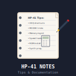

# hp-41_notes

 

## HP-41: Taking notes on the calculator

**NOTE:** This program is part of the ISENE.ROM (https://github.com/isene/hp-41_isene-rom). The FOCAL listing can be found in the "src" folder of that project. Any updates and new version will be found there.

No real PDA can do withou a quick notes taker. The same goes for the best PDA ever created: The HP-41.

The simple feature list:

* Simple interface for adding new notes
* Listing notes (or printing them if a printer is attatched
* Editing, sorting and searching

Here is the key mapping (what shows in the programs menu is in parenthesis):

Label (Menu)	|Description
----------------|-----------
NOTES	|Starts the NOTES program. Shows some of the mapping for the top keys so that you don’t have to remember this list. Pressing R/S will give you the version number of NOTES, another R/S will get you back to the mapping/menu..
N+	|Enter the note in the alpha register. Then XEQ “N+”. This is a global label so that you can assign it to a key for easy entry of new appointments.
LBL A (+)	|Same as N+ above, but used inside the program.
LBL a (-)	|Delete the current record.
LBL B (L)	|List all notes. If you have a printer attatched, it will print them.
LBL b (E)	|Edit the current note (calls ED)
LBL C (?)	|Search the notes file for string in alpha register.
LBL D (S)	|Forces a sort of the notes file (“NOTES”).
LBL d (/)	|Forces shrinkage of the “NOTES”-file..
LBL E (\*)	|Go back to the menu.

Technical notes: This program needs an HP-41CX or the equivalent. It also needs an ascii file called “NOTES” to store the events. It further needs the programs “FLSORT” and “FLSZ+”.

## License
This software is released into the Public Domain.
